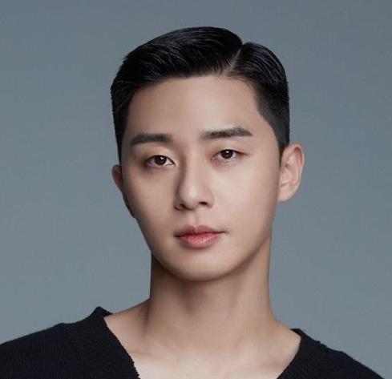
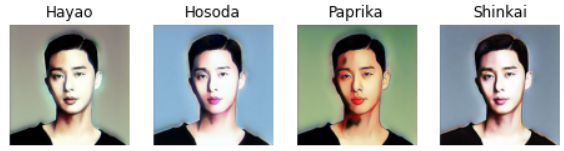
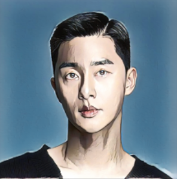
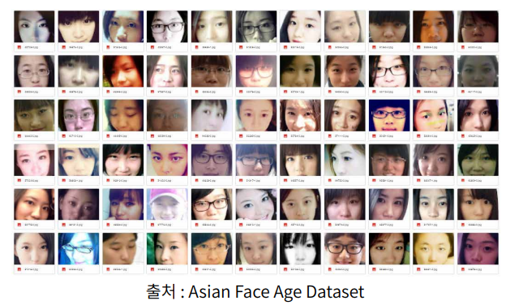
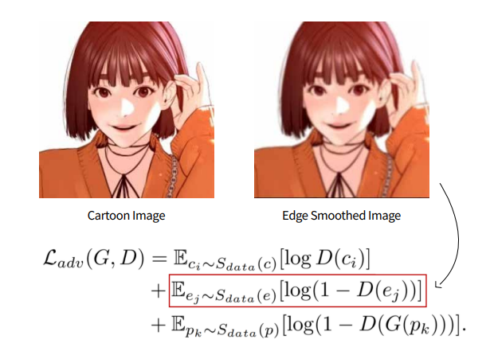
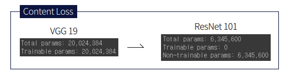
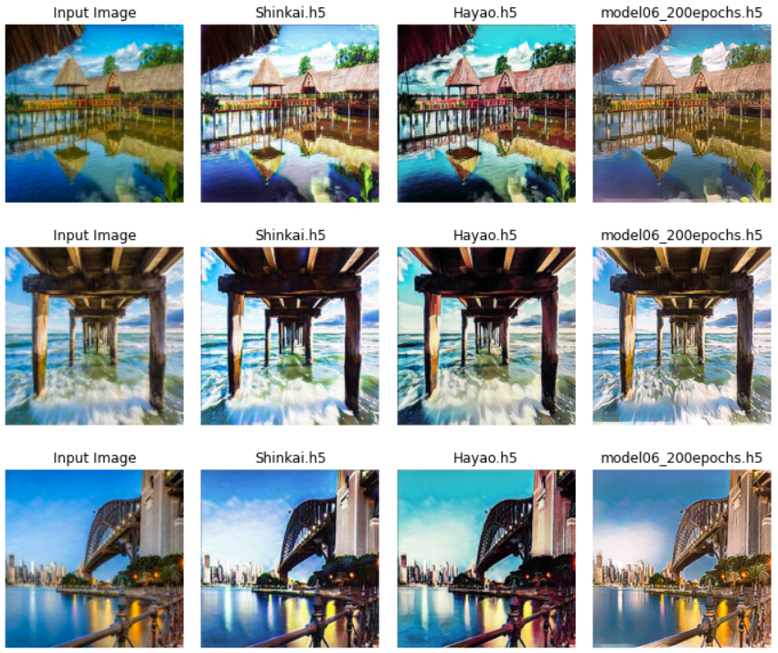
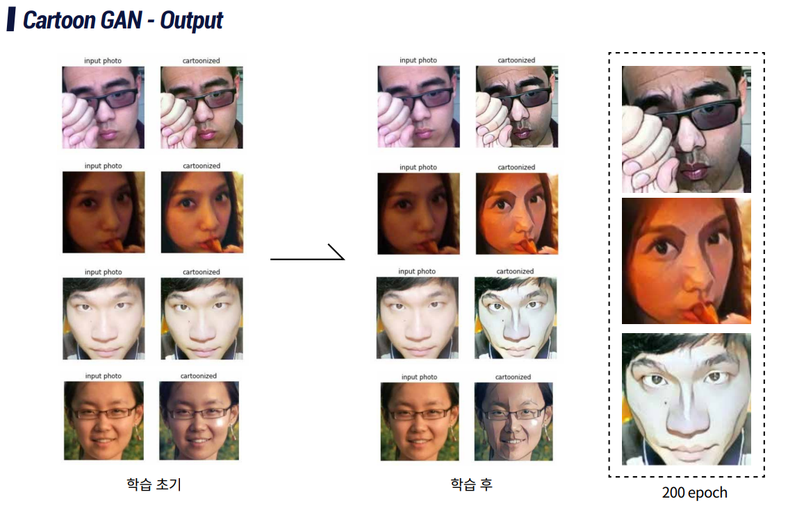

# CartoonGAN_modified
## 0. Requirement

- python : 3.7.12
- tensorflow : 2.7.0

## 1. Background

저는 멀티캠퍼스에서 국비지원으로 딥러닝과정을 수료한 학생입니다. GAN을 통한 이미지 변환을 주제로 프로젝트를 진행했습니다. 이미지를 카툰화한 모델을 찾던 도중 `CartoonGAN` 이란 모델을 알게 되어 프로젝트에 활용하고자 했습니다. 

모델이 나온지 좀 되어 라이브러리 내 메서드화 된 코드들을 변경해주었고 주제넘지만 반복되는 코드들이 많아 리팩토링을 진행했습니다. 또한 저는 인물 이미지를 변화하고 싶었는데 기존 CartoonGAN 모델은 인물보단 배경 이미지 변환에 맞춰져 있는 것 같아 모델 일부를 튜닝했습니다.

아직 배운지 얼마 안된 학생이고 GAN은 독학으로 공부를 진행하여 미숙한 부분이 많은 점 참고 해주시면 감사하겠습니다.

## 2. 기존 모델의 이미지 변환

- input image

  샘플 이미지는 제가 좋아하는 배우 박서준님을 사용했습니다.

  

  

- 기존 모델

​	아무래도 기존 모델들은 인물+배경을 학습한 모델이다 보니 인물을 변환 시 부자연스러운 것을 확인할  수 있습니다. 또한 애니메이션의 특징인 부드러운 음영을 살리고자한 모델이기 때문에 출력된 이미지들이 번지듯이 출력되었습니다.

- 개선된 모델

  

  기존 모델을 튜닝하여 새롭게 만든 모델의 출력 결과입니다.

## 3.  데이터 셋

작업환경은 colab에서 진행했고 무료 버전으로는 gpu 사용시간이 너무 부족하여(70분) colab pro로 업그레이드하여 진행했습니다.

- 활용 데이터셋

  - **애니메이션 데이터** : selfie2anime, 네이버 웹툰(싸움독학) - 총 3200 장

    (출처 : https://www.kaggle.com/arnaud58/selfie2anime, 네이버 웹툰)

    > slefie2anime 데이터는 이목구비가 과장된 이미지라 좀 더 현실에 가까운 싸움독학 이미지를 넣었습니다.

    

    

  - **인물 데이터** : 아시안 인물 사진 (AFAD, 20살 데이터셋만 사용했습니다.)  - 총 3200장

    (출처 : https://afad-dataset.github.io/)

    

    

  - **가우시안 블러처리 이미지** : 애니메이션 데이터셋을 가우시안 블러처리한 데이터 셋입니다.

    > 논문에 따르면 일반적인 일반적인 Adversarial Loss를 사용하여 학습했을 때 출력된 이미지의 가장자리 선이 뚜렷하지 않다는 문제가 있어서 이를 해결하기 위해서 미리 블러 처리한 이미지 데이터셋을 사용하고 판별자가 이러한 이미지를 fake image로 판별하도록 하는 loss 값을 추가했다고 했습니다.

​			

​			위의 두 이미지가 블러처리 여부에 따른 이미지들입니다.

​			빨간 네모로 표시한 loss값이 가장자리가 처리된 이미지의 loss값 입니다.

## 4. 모델 학습

- CartoonGAN을 학습하기 전 `U GAT IT`(ICLR 2020)  모델을 학습하던 중 loss를 구할 때 gan 말고도 wgan, lsgan으로 구하는 것을 참고하여 그 중 lsgan의 loss값을 구하는 방법으로 loss 값 설정을 바꿨습니다.

- feature 추출에서 네트워크로 VGG19, ResNet101 두 개를 사용해 봤고 해당 모델은 resnet101의 결과입니다.

  

- epoch은 200으로 설정했고 epoch당 시간은 460초 정도 걸렸습니다.

  

## 5. 한계점 및 느낀점

- 배경 이미지 변환에 약한 모습을 보였습니다.(가장 오른쪽이 개선한 모델입니다.)

  

  

- 인물 이미지가 음영이 짙으면 결과물이 안 좋은 것을 발견했습니다.

  

  1, 3번 이미지는 얼굴에 음영이 짙지 않아 변환이 잘 일어났지만 2, 4번 이미지는 음영이 짙어 변환된 이미지에서 음영이 구역으로 분리된 것 처럼 나왔습니다. (데이터셋 준비 시 대비 조정이 필요할 것 같습니다.)

- one to one 이미지 변환은 CycleGAN을 모태로 변환된 모델들이 많은 것 같았습니다. 하지만 CycleGAN은 shape을 변화시켜주진 않기 때문에 후에 좀 더 공부를 하여 shape부분을 변경해주는 GAN모델(U GAT IT, starGAN, styleGAN 등)을 공부해보고 싶었습니다. ~~사실 공부는 했지만 아직 어려운 부분이 많아 컨텐츠 변경 모델을 진행했습니다...~~

## Reference

- CartoonGAN paper (https://openaccess.thecvf.com/content_cvpr_2018/papers/Chen_CartoonGAN_Generative_Adversarial_CVPR_2018_paper.pdf)
- U-GAT-IT paper (https://arxiv.org/abs/1907.10830)
- U-GAT-IT 저자 온라인 설명(https://www.youtube.com/watch?v=SD7AeJIvknI&t=5159s)
- keras 공식문서 - Cycle GAN(https://keras.io/examples/generative/cyclegan/)

- CartoonGAN review (https://blog.diyaml.com/teampost/Improving-CartoonGAN/)

