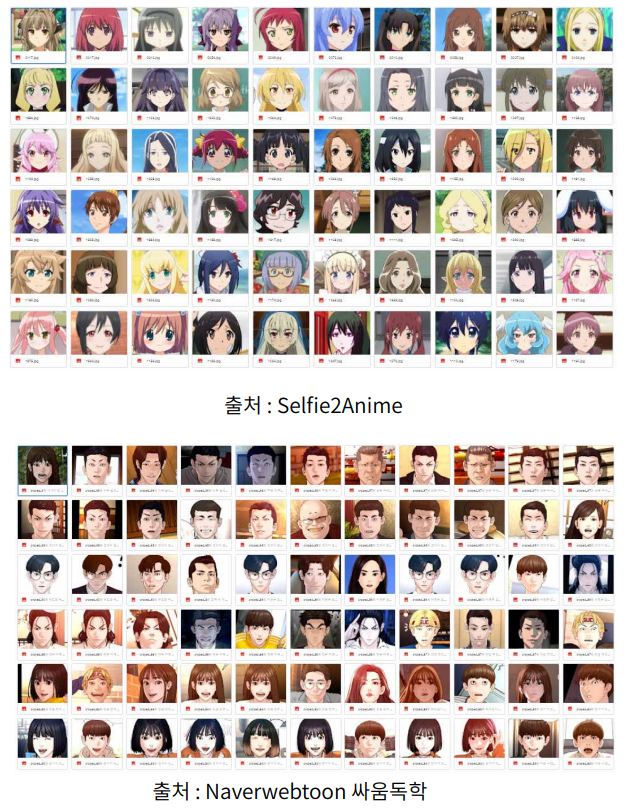

# CartoonGAN_modified
## 0. Requirement

- python : 3.7.12
- tensorflow : 2.7.0

## 1. Background

저는 멀티캠퍼스에서 국비지원으로 딥러닝과정을 수료한 학생입니다. GAN을 통한 이미지 변환을 주제로 프로젝트를 진행했습니다. 이미지를 카툰화한 모델을 찾던 도중 `CartoonGAN` 이란 모델을 알게 되어 프로젝트에 활용하고자 했습니다. 

모델이 나온지 좀 되어 라이브러리 내 메서드화 된 코드들을 변경해주었고 주제넘지만 반복되는 코드들이 많아 리팩토링을 진행했습니다. 또한 저는 인물 이미지를 변화하고 싶었는데 기존 CartoonGAN 모델은 인물보단 배경 이미지 변환에 맞춰져 있는 것 같아 모델 일부를 튜닝했습니다.

아직 배운지 얼마 안된 학생이고 GAN은 독학으로 공부를 진행하여 미숙한 부분이 많은 점 참고 해주시면 감사하겠습니다.

## 2. 기존 모델의 이미지 변환

- input image

  샘플 이미지는 제가 좋아하는 배우 박서준님을 사용했습니다.

  

  

- 기존 모델

​	아무래도 기존 모델들은 인물+배경을 학습한 모델이다 보니 인물을 변환 시 부자연스러운 것을 확인할  수 있습니다. 또한 애니메이션의 특징인 부드러운 음영을 살리고자한 모델이기 때문에 출력된 이미지들이 번지듯이 출력되었습니다.

- 개선된 모델

  

  기존 모델을 튜닝하여 새롭게 만든 모델의 출력 결과입니다.

## 3.  모델 튜닝

작업환경은 colab에서 진행했고 무료 버전으로는 gpu 사용시간이 너무 부족하여(70분) colab pro로 업그레이드하여 진행했습니다.

- 활용 데이터셋

  - **애니메이션 데이터** : selfie2anime, 네이버 웹툰(싸움독학) - 총 3200 장

    (출처 : https://www.kaggle.com/arnaud58/selfie2anime, 네이버 웹툰)

    > slefie2anime 데이터는 이목구비가 과장된 이미지라 좀 더 현실에 가까운 싸움독학 이미지를 넣었습니다.

    

    

  - **인물 데이터** : 아시안 인물 사진 (AFAD, 20살 데이터셋만 사용했습니다.)  - 총 3200장

    (출처 : https://afad-dataset.github.io/)

    

    

  - **가우시안 블러처리 이미지** : 애니메이션 데이터셋을 가우시안 블러처리한 데이터 셋입니다.

    > 논문에 따르면 일반적인 일반적인 Adversarial Loss를 사용하여 학습했을 때 출력된 이미지의 가장자리 선이 뚜렷하지 않다는 문제가 있어서 이를 해결하기 위해서 미리 블러 처리한 이미지 데이터셋을 사용하고 판별자가 이러한 이미지를 fake image로 판별하도록 하는 loss 값을 추가했다고 했습니다.

​			

​			위의 두 이미지가 블러처리 여부에 따른 이미지들입니다.

​			빨간 네모로 표시한 loss값이 가장자리가 처리된 이미지의 loss값 입니다.

